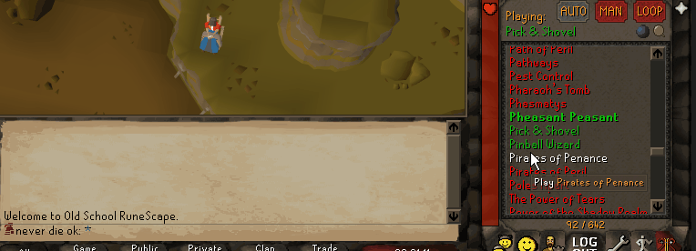
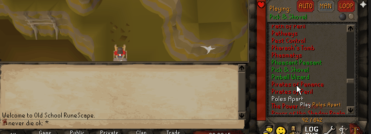

#  Music Replacer 
 This plugin enables you to replace OSRS music tracks with your own music.
 It also allows you to search the music from youtube.  

The replaced (or "overridden") tracks will "behave" like the normal music. That is, it'll play whenever the original track would play and volume is controlled by the one in-game.
  
❗ **Note**: the [music plugin] is required to be **on** and you must've changed volume through it at least once.
(Because this plugin uses the [music plugin]'s music volume config item.)
 
 ## 💁 Usage
 Go to the track you wish to replace in the track list.  
 For ease of use you can click on the currently playing track 
 (or use the search functionality of the [music plugin](https://github.com/runelite/runelite/wiki/Music#music-plugin-configuration)).  

 Right click on the track you wish to replace and click `Override`.  
 Then choose to override `With a local file.` or `From a youtube search.`.
 
 When overriding from a youtube search enter your desired search term and choose an item.  
 Use `Continue` to see more search results.  
   
 The audio will then be downloaded (to the `.runelite\music-overrides` folder) and when finished the track will be replaced.  
 When hovering over its currently-playing label you'll see the original url, title, uploader etc.
 
 When overriding with a local file just enter the full path and press `enter`.  
   
 The track will be **bold** and when hovering over its currently-playing label you'll see its original path (files are copied to your `.runelite\music-overrides` folder and played from there).  
**NOTE:** Currently only `.wav` files can be used!
 
 To remove an override right click (an overridden) track and select `Remove override`.  
 To remove all overrides right click the music tab and select `Remove overrides`.  
 
 You can also "bulk" override with local songs. To do this right click the music tab and select "Override tracks".  
 Then enter the directory with the tracks. For this to work the file names must be identical to the track name.

## Attribution
This project uses the [JaCo mp3 player](http://jacomp3player.sourceforge.net) to play mp3, its source can be found [here](https://sourceforge.net/p/jacomp3player/code/HEAD/tree/).
The JaCo project is licensed under LGPL which you can find [here](./legal/lgpl-3.0.txt) or otherwise [here](https://www.gnu.org/licenses/lgpl-3.0.en.html).
In case one wishes to swap out JaCo for something different, one can clone this plugin and implement the [MusicPlayer](./src/main/java/nl/alowaniak/runelite/musicreplacer/MusicPlayer.java) for the mp3 extension.
 
 ## 💌 Support
 For any questions or feedback you can find me on Discord as `Mr.A#0220`
 
 There are currently still some bugs/missing features such as:
 - Login screen music can't be overridden
  
 Feel free to help out by creating issues, pull requests, or just messaging me (on Discord).
 
 [music plugin]: https://github.com/runelite/runelite/wiki/Music#music-plugin-configuration
