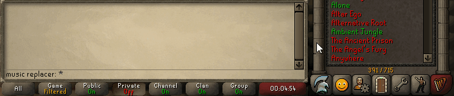
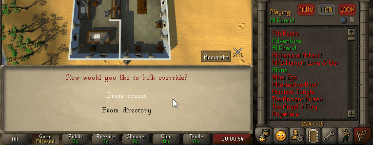
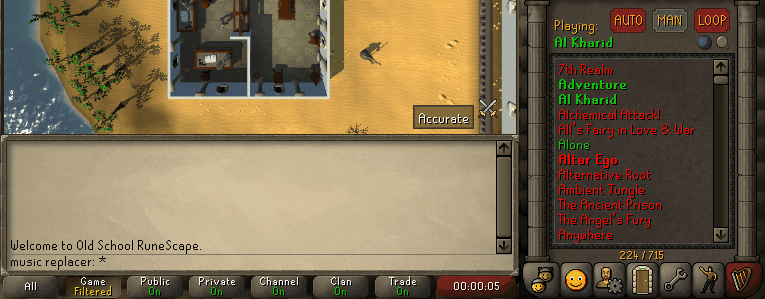
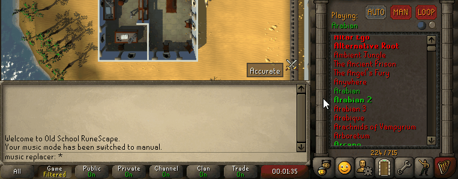
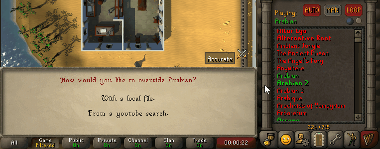
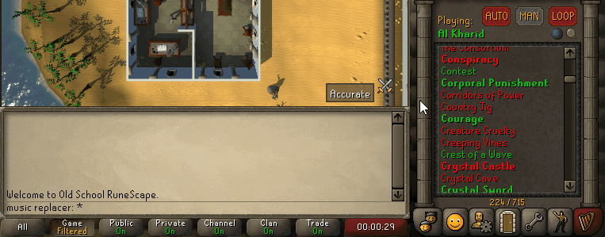
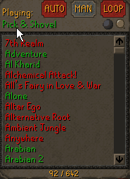

#  Music Replacer
Replace OSRS tracks with presets (such as OSRSBeatz or RS3 music) or your own music.
It also allows you to search the music from youtube.

The replaced (or "overridden") tracks will behave like the normal music.
That is, it'll play whenever the original track would play and volume is controlled by the one in-game.

❗ **Note**: the [music plugin] is required to be **on** and you must've changed volume through it at least once.
(Because this plugin uses the [music plugin]'s music volume config item.)
 
## 💁 Usage
### Bulk Override
With bulk override you can replace multiple tracks at once.
Just right-click on the music-tab, choose `Override tracks` and select if you want to override `From preset` or `From directory` (local).  

#### From preset
With presets you can easily replace all (available) tracks by some preset such as OSRSBeatz or RS3 music.
When you select a preset it will begin downloading all the tracks in the preset ([or possibly skip if already overridden](#skip-overidden-if-bulk)).
(Note that if you stop runelite prematurely it may not have overridden all tracks available in the preset.)  
  
(In case you're missing any track in an existing preset, or a preset altogether, please create a [PR](https://docs.github.com/en/pull-requests/collaborating-with-pull-requests/proposing-changes-to-your-work-with-pull-requests/about-pull-requests) for the [presets file](./src/main/resources/presets.json)).

#### From directory
You can also bulk override with ([supported](#supported-formats)) local files.
To do this just select the folder which contains the files.
For this to work the file names must be **identical** to the track name.  

#### Skip overidden if bulk
In the config there's a `Skip overridden if bulk` checkbox that, when on, will cause bulk-override to skip any already overridden files.
Useful when you've already manually overridden a few files, now want to use a preset but don't want to override the ones you already replaced.

### Single override
To replace single tracks go to the track you wish to replace in the track list.
(For ease of use you can [jump to track](#jump-to-track) or use the search functionality of the [music plugin](https://github.com/runelite/runelite/wiki/Music#music-plugin-configuration)).
Right-click on the track you wish to replace and click `Override`.
Then choose to override `With a local file.` or `From a youtube search.`.  
 

#### From a youtube search
When overriding from a youtube search enter your desired search term and choose an item.
Use `Continue` to see more search results.
The audio will then be downloaded and when finished the track will be replaced.  
  

#### From a local file
When overriding with a local file just select with which ([supported](#supported-formats)) file you want to override.  

### Removing overrides
- To remove all overrides right-click the music tab and select `Remove overrides`.
- To remove a single override right-click (an overridden) track and select `Remove override`.

### Jump to track
Clicking on the currently playing label will jump to the track in the music list.  

### Supported formats
Currently only `wav` (in CD quality) and `mp3` formats are supported.

## Attribution
This project uses the [JaCo mp3 player](http://jacomp3player.sourceforge.net) to play mp3, its source can be found [here](https://sourceforge.net/p/jacomp3player/code/HEAD/tree/).
The JaCo project is licensed under LGPL which you can find [here](./legal/lgpl-3.0.txt) or otherwise [here](https://www.gnu.org/licenses/lgpl-3.0.en.html).
In case one wishes to swap out JaCo for something different, one can clone this plugin and implement the [MusicPlayer](./src/main/java/nl/alowaniak/runelite/musicreplacer/MusicPlayer.java) for the mp3 extension.

## 💌 Support
For any questions or feedback you can find me on Discord as `Mr.A#0220`

Feel free to help out by creating issues, pull requests, or just messaging me (on Discord).

[music plugin]: https://github.com/runelite/runelite/wiki/Music#music-plugin-configuration
